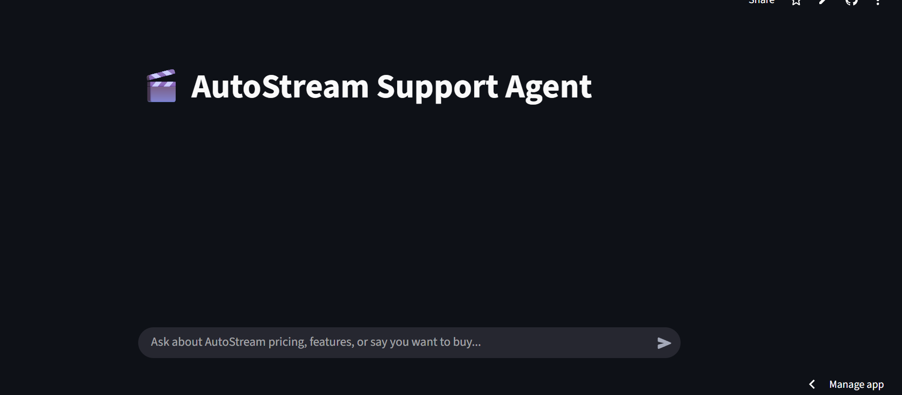

# autostream_agent
# 🎬AutoStream Agent

[](https://opensource.org/licenses/MIT)
[](https://www.python.org/downloads/)
[](https://streamlit.io)
[](https://ai.google.dev/)

> **An intelligent AI agent that automates lead capture and product support for AutoStream, a fictional content creation SaaS platform.**

[Live Demo](#) | [Architecture](#architecture) | [Features](#features) | [Quick Start](#quick-start)

---

## 📖 Overview

**AutoStream Agent** is a conversational AI system designed to handle real-world social media → sales automation workflows. Built for the GenAI assignment, it demonstrates how modern AI agents can:

- Engage users in natural conversations
- Answer product queries using RAG (Retrieval-Augmented Generation)
- Capture high-intent leads through multi-turn dialogue
- Maintain context across sessions

This project simulates a production-ready agent for **AutoStream** — a platform that helps content creators automate their workflows across YouTube, TikTok, Instagram, and Twitch.

---

## 🎯 Problem Statement

Social media DMs generate high volumes of support and sales inquiries, but manual responses are:
- **Time-consuming** for human teams
- **Inconsistent** in quality and speed
- **Leak high-intent leads** when response times are slow

### Solution

An AI agent that:
1. **Classifies user intent** (greeting, product query, purchase intent)
2. **Retrieves accurate product information** from a knowledge base
3. **Captures leads systematically** by collecting name, email, and platform
4. **Hands off qualified leads** to human sales teams

---

## 🏗️ Architecture

┌─────────────────────────────────────────────────────────────┐
│ Streamlit Chat UI │
│ (app_streamlit.py) │
└──────────────────────┬──────────────────────────────────────┘
│
▼
┌─────────────────────────────────────────────────────────────┐
│ Agent Orchestration Layer │
│ (agent/streamlit_agent.py) │
│ ┌─────────────┬──────────────┬──────────────┬───────────┐ │
│ │ Intent │ Slot Filling │ Lead Capture │ Context │ │
│ │ Classifier │ (name/email) │ Logic │ Manager │ │
│ └─────────────┴──────────────┴──────────────┴───────────┘ │
└───────┬──────────────────┬──────────────────────┬───────────┘
│ │ │
▼ ▼ ▼
┌──────────────┐ ┌────────────────┐ ┌──────────────────┐
│ Intent │ │ RAG Retriever │ │ Google Gemini │
│ Classifier │ │ (rag/) │ │ LLM (agent/llm) │
│ (agent/) │ │ - Docs loader │ │ - System prompts │
│ │ │ - Similarity │ │ - Context inject │
└──────────────┘ └────────────────┘ └──────────────────┘
│
▼
┌────────────────┐
│ Knowledge Base │
│ (rag/docs/) │
│ - pricing.txt │
│ - features.txt │
│ - policies.txt │
└────────────────┘

text

### Components

| Component | File | Purpose |
|-----------|------|---------|
| **Chat UI** | `app_streamlit.py` | Streamlit-based conversational interface |
| **Agent Core** | `agent/streamlit_agent.py` | Orchestrates intent, RAG, and lead flow |
| **Intent Classifier** | `agent/intent.py` | Categorizes user messages (greeting/product/high-intent) |
| **LLM Interface** | `agent/llm.py` | Gemini 2.0 Flash API wrapper with system prompts |
| **RAG Retriever** | `rag/retriever.py` | Loads docs and retrieves relevant context |
| **Lead Capture** | `tools/lead_capture.py` | Mock CRM integration for storing leads |
| **State Manager** | `agent/state.py` | Maintains conversation context across turns |

---

## ✨ Features

### 🤖 Conversational AI
- Natural language understanding via Google Gemini 2.0 Flash
- Context-aware responses using conversation history
- Smooth transitions between product support and lead capture

### 🔍 RAG-Powered Product Knowledge
- Retrieves accurate information from AutoStream's knowledge base
- Answers questions about pricing, features, platforms, and policies
- Reduces hallucinations by grounding responses in real docs

### 🎣 Intelligent Lead Capture
- Detects high-intent phrases ("I want to buy", "sign me up")
- Multi-turn slot filling (name → email → platform)
- Validates inputs (email format, platform names)
- Exports leads to mock CRM system

### 💬 Streamlit Chat Interface
- Clean, responsive UI with chat history
- Session state management for persistent conversations
- Real-time message streaming

---

## 🛠️ Tech Stack

| Layer | Technology |
|-------|-----------|
| **Frontend** | Streamlit (Chat UI) |
| **LLM** | Google Gemini 2.0 Flash (`google-genai` SDK) |
| **RAG** | Custom document retriever (text similarity) |
| **Language** | Python 3.10+ |
| **State Management** | In-memory session state (AgentState dict) |
| **Deployment** | Streamlit Community Cloud |

---

## 📊 User Flow

### Example Conversation (High-Intent Lead)

User: Hey, I want to buy AutoStream
Agent: Great! May I know your name? Please say: "my name is ..."

User: my name is Vanshika
Agent: Please share your email so the team can contact you.

User: XYZ@gmail.com
Agent: Which platform do you mainly create content for? (YouTube, TikTok, Instagram, Twitch)

User: YouTube
Agent: Thanks! You're all set. The team will reach out shortly about AutoStream.

[✅ Lead captured: Vanshika | XYZ@gmail.com | YouTube]

text

### Example Conversation (Product Query)

User: What's included in the Pro plan?
Agent: The Pro plan includes unlimited video streaming,
multi-platform scheduling (YouTube, TikTok, Instagram),
advanced analytics, priority support, and custom branding options.

User: How much does it cost?
Agent: The Pro plan is $49/month or $490/year (2 months free).

text

---

## 🚀 Quick Start

### Prerequisites

- Python 3.10 or higher
- Google AI Studio API key ([Get one here](https://aistudio.google.com/app/apikey))
- Git

### 1. Clone the Repository

git clone https://github.com/GIT-vanshika/autostream_agent.git
cd autostream-agent
### 2. Set Up Virtual Environment
bash
# Using conda
conda create -n autostream python=3.10 -y
conda activate autostream

# OR using venv
python -m venv venv
source venv/bin/activate 
### 3. Install Dependencies
bash
pip install -r requirements.txt
### 4. Configure API Key
Create a .env file in the project root:

bash
GOOGLE_API_KEY=your_gemini_api_key_here
### 5. Run the Streamlit UI
bash
streamlit run app_streamlit.py
Open your browser at http://localhost:8501 and start chatting!

### 6. (Optional) Run CLI Version
bash
python app.py
☁️ Deploy to Streamlit Cloud
Step 1: Push to GitHub
bash
git add .
git commit -m "Initial commit"
git push origin main
Step 2: Deploy on Streamlit Cloud
Go to share.streamlit.io

Click New app

Select your repository: <your-github-username>/autostream-agent

Set Main file path: app_streamlit.py

Add Secrets (under Advanced settings):

text
GOOGLE_API_KEY = "your_gemini_api_key_here"
Click Deploy

Your app will be live at [https://<app-name>.streamlit.app/ within 2-3 minutes.](https://git-vanshika-autostream-agent-app-streamlit-uzb7e0.streamlit.app/)

📸 Demo

Chat UI
Clean Streamlit chat interface with message history

Lead Capture Flow
Lead Capture
Multi-turn dialogue for collecting name, email, and platform

Product Query with RAG
Product Query
RAG-powered accurate responses from knowledge base

Note: Replace placeholder screenshots with your actual UI images in the screenshots/ folder.

### 📁 Project Structure
text
autostream-agent/
├── agent/
│   ├── __init__.py
│   ├── state.py              
│   ├── intent.py             
│   ├── llm.py                
│   └── streamlit_agent.py   
├── rag/
│   ├── __init__.py
│   ├── retriever.py          
│   └── docs/                 
│       ├── pricing.txt
│       ├── features.txt
│       └── policies.txt
├── tools/
│   ├── __init__.py
│   └── lead_capture.py       
├── screenshots/             
├── .env                    
├── .gitignore
├── app.py                    
├── app_streamlit.py          
├── config.py                 
├── requirements.txt  
├── README.md        
└── LICENSE               
## 🔧 Configuration
Environment Variables
Variable	Description	Required
GOOGLE_API_KEY	Google AI Studio API key for Gemini	✅ Yes
Customizing the Knowledge Base
Add or modify files in rag/docs/:

## text
rag/docs/
├── pricing.txt       
├── features.txt      
└── policies.txt      
The RAG retriever will automatically load all .txt files.

## 🧪 Testing
Test LLM Connection
bash
python test_llm.py
Expected output:

text
✅ LLM Test: Hello! How can I help you with AutoStream today?
Test RAG Retriever
bash
python test_rag.py
Expected output:

text
✅ RAG Test: Retrieved 2 relevant docs for 'pricing'
🌟 Future Improvements
 Vector database integration (Pinecone/Chroma) for scalable RAG

 Multi-language support for global users

 Sentiment analysis to detect frustrated users and escalate to human agents

 Real CRM integration (HubSpot, Salesforce)

 Voice interface using Whisper + ElevenLabs

 A/B testing for different response styles

 Analytics dashboard for lead conversion metrics

 Agent memory across sessions using persistent storage

## 👩‍💻 Author
Vanshika
Data Science| AI/ML Enthusiast

GitHub: @GIT-vanshika

LinkedIn: https://www.linkedin.com/in/vanshika-reja/

Built as part of the GenAI Assignment to deonstrate production-ready AI agent development.

## 📄 License
This project is licensed under the MIT License - see the LICENSE file for details.


⭐ Star this repo if you found it helpful!

Made with ❤️ for the future of AI-powered customer engagement

</div> ```